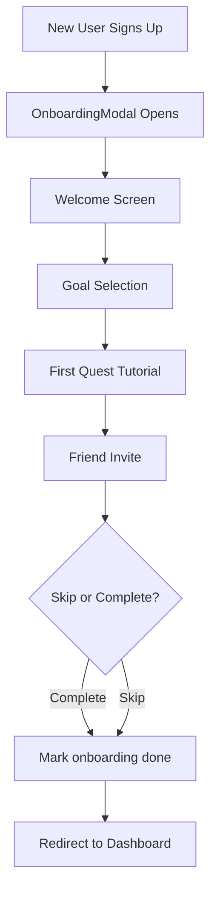

# Onboarding & Analytics Features

## Overview
Two new modular features added to enhance user experience and track growth:
1. **First-Time User Onboarding Flow** - Guides new users through app setup
2. **Analytics Dashboard "My Growth"** - Provides insights into user progress

---

## 1. Onboarding Flow

### Purpose
Welcome new users and guide them through initial setup to increase activation and retention.

### Flow Steps

1. **Welcome Screen** - Introduction to app benefits
2. **Goal Selection** - User chooses primary challenge (screentime, focus, social media, productivity)
3. **First Quest Tutorial** - Shows today's quest with explanation
4. **Friend Invite** (optional) - QR code + share link with skip option

### Database Schema

#### Table: `onboarding_progress`
Tracks user onboarding completion status.

**Columns:**
- `id` (UUID) - Primary key
- `user_id` (UUID) - Foreign key to auth.users
- `step_completed` (TEXT) - Last completed step (welcome, goal, quest, invite)
- `completed_at` (TIMESTAMP) - When onboarding was finished
- `skipped` (BOOLEAN) - Whether invite step was skipped
- `created_at`, `updated_at` (TIMESTAMP)

**RLS Policies:**
- Users can view, insert, and update their own onboarding progress

### Components

- `OnboardingModal.tsx` - Main modal container managing flow
- `OnboardingWelcome.tsx` - Step 1: Welcome message
- `OnboardingGoalSelection.tsx` - Step 2: Choose main challenge
- `OnboardingFirstQuest.tsx` - Step 3: Show first quest
- `OnboardingInvite.tsx` - Step 4: Referral QR code + share
- `OnboardingWrapper.tsx` - Wrapper that conditionally shows onboarding
- `useOnboarding.tsx` - Hook to check onboarding status

### Integration

Added to `AppLayout.tsx` via `OnboardingWrapper` component. Shows automatically for new users on first login.

### User Flow



---

## 2. Analytics Dashboard (My Growth)

### Purpose
Help users visualize progress, celebrate milestones, and stay motivated.

### Route
`/insights` - New page added to app navigation

### Sections

#### A. Weekly Summary Card
Shows last 7 days aggregated stats:
- XP Earned
- Quests Completed
- Current Streak
- Time Saved

#### B. 30-Day Charts
Interactive charts with tabs:
- XP Earned (line chart)
- Quests Completed (bar chart)
- Time Saved (line chart)

Built with Recharts library.

#### C. Archetype Progress
Shows:
- Current archetype
- Level progress bar
- XP to next level

#### D. Leaderboard Insights
Displays:
- User's current league rank
- Nearby competitors (±2 positions)
- Promotion/demotion indicators

#### E. Export Analytics
Buttons to:
- Export CSV of last 30 days
- Share progress (future feature)

### Database Schema

#### Table: `user_analytics_daily`
Stores daily aggregated stats for each user.

**Columns:**
- `id` (UUID) - Primary key
- `user_id` (UUID) - Foreign key
- `date` (DATE) - The day being tracked
- `xp_earned` (INTEGER) - Total XP earned that day
- `quests_completed` (INTEGER) - Number of quests done
- `time_saved_minutes` (INTEGER) - Estimated time saved
- `streak` (INTEGER) - Streak value on that day
- `created_at` (TIMESTAMP)

**Unique Constraint:** `(user_id, date)` - One record per user per day

**RLS Policies:**
- Users can view their own analytics
- Service role can insert/update (via edge function)

#### Table: `user_milestones`
Tracks special achievements.

**Columns:**
- `id` (UUID) - Primary key
- `user_id` (UUID) - Foreign key
- `milestone_type` (TEXT) - Type of milestone (streak_week, xp_milestone, etc.)
- `milestone_value` (INTEGER) - Value achieved
- `achieved_at` (TIMESTAMP) - When milestone was reached
- `created_at` (TIMESTAMP)

**RLS Policies:**
- Users can view their own milestones
- Service role can insert

### Edge Function

#### `track-analytics` (Public, called after quest completion)
**Purpose:** Records daily stats and checks for milestones

**Input:**
```json
{
  "xp_earned": 250,
  "quests_completed": 1,
  "time_saved_minutes": 15
}
```

**Logic:**
1. Get current user from auth
2. Get today's date
3. Upsert analytics record for today (aggregates if multiple quests completed)
4. Check for milestones:
   - 7-day streak multiples
   - XP milestones (1000+)
5. Insert milestone records if achieved

**Called From:** `complete-quest` edge function after quest completion

### Components

- `InsightsPage.tsx` - Main page at `/insights`
- `WeeklySummaryCard.tsx` - 7-day stats overview
- `ThirtyDayCharts.tsx` - Interactive charts with tabs
- `ArchetypeProgress.tsx` - Level and archetype display
- `LeaderboardInsights.tsx` - Rank and nearby competitors
- `ExportAnalytics.tsx` - CSV export + share buttons

### Navigation

Added "Insights" tab to `MobileNav.tsx` with TrendingUp icon.

---

## Integration Points

### Quest Completion Flow
```
User completes quest
  ↓
complete-quest function
  ↓
├─ track-league-participation (existing)
└─ track-analytics (NEW) ← Logs daily stats
```

### New User Flow
```
User signs up
  ↓
Login to app
  ↓
AppLayout checks onboarding_progress
  ↓
If not completed → Show OnboardingModal
  ↓
User completes onboarding
  ↓
Record saved to database
  ↓
Modal dismissed, redirect to Dashboard
```

---

## Feature Flags

Both features are **enabled by default** with no additional configuration needed.

To disable in future:
- **Onboarding:** Remove `OnboardingWrapper` from `AppLayout.tsx`
- **Analytics:** Remove route and navigation item

---

## Success Metrics

### Onboarding
- **Activation Rate:** % of new users who complete onboarding
- **Referral CTR:** % who share invite link
- **Time to First Quest:** Time from signup to first quest completion

### Analytics
- **Engagement:** % of users who visit /insights weekly
- **Export Rate:** % of users who export their data
- **Session Duration:** Time spent viewing analytics

---

## Testing Checklist

### Onboarding
- [ ] New user sees onboarding modal on first login
- [ ] Can navigate through all 4 steps
- [ ] Goal selection requires a choice before proceeding
- [ ] Quest displays correctly from API
- [ ] QR code generates with valid referral link
- [ ] Can skip invite step
- [ ] Onboarding doesn't show again after completion
- [ ] Database records `onboarding_progress` correctly

### Analytics
- [ ] `/insights` page loads without errors
- [ ] Weekly summary shows accurate last 7 days data
- [ ] 30-day charts render with correct data
- [ ] Chart tabs switch properly (XP, Quests, Time)
- [ ] Archetype progress shows current level and XP
- [ ] Leaderboard insights display user's rank
- [ ] CSV export downloads with correct data format
- [ ] Analytics updates after completing a quest

---

## Backward Compatibility

✅ **Fully backward compatible** - Both features are purely additive:
- No existing tables modified
- No existing components changed (except AppLayout wrapper)
- Existing quest flow unchanged (only extended with analytics call)
- No breaking changes to APIs or UI

---

## Database Migrations

All tables created with RLS enabled and proper policies. Run via Lovable Cloud migration tool (already executed).

**Tables added:**
1. `onboarding_progress`
2. `user_analytics_daily`
3. `user_milestones`

**Indexes added:**
- `idx_user_analytics_daily_user_date` - Fast queries by user and date
- `idx_user_milestones_user` - Fast milestone lookups

---

## Notes

- **Weekly Leagues (Priority 3)** was already implemented in previous work
- Onboarding uses existing quest API (`get-daily-quest`)
- Analytics leverages existing league leaderboard functions
- All new code follows existing design system and patterns
